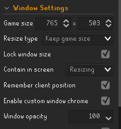
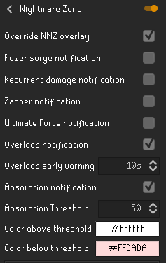
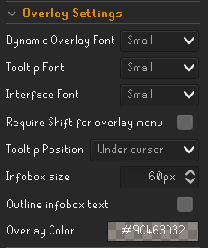
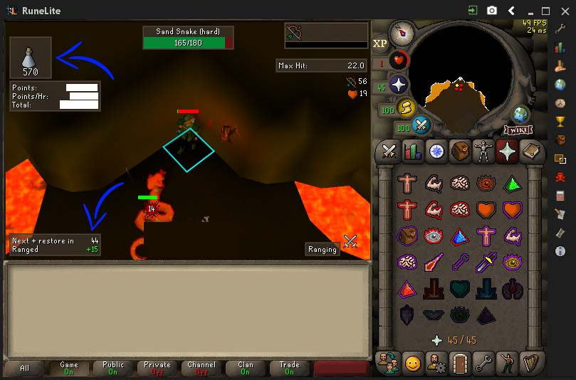

#NMZPro
Project with the goal of creating the perfect NMZ emulator.

Current support for absorption/rock-cake methods:

• Ranging using NMZ Super ranging pots.

• Strength using super strength pots.

##Required window settings:

• Must use fixed - classic layout

• Minimum size only

• Maximum OSRS brightness

##Runelite NMZ plugin settings:

##Runelite overlay settings:

##Brightness (required):

##General Window Setup: 

• There must be no widgets (other than absorption pots remaining) in the top left corner.

• Potion buff info must be in the bottom left
    
• Under Runelite "Boosts Information", turn on "Use Relative Boosts"

• Turn ammo plugin off. It obstructs the buff timer.

Your setup in general should look like this:

