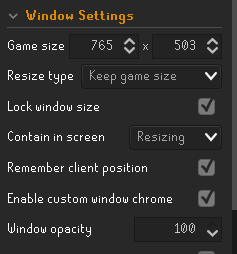

# NMZPro
Project with the goal of creating the perfect NMZ emulator.

Runelite NMZ plugin settings:

• "Override NMZ Overlay" must be turned off.

Runelite widget settings:

• There must be no widgets in the top left corner.

• Potion buff info must be in the bottom left
    
• Under Runelite "Boosts Information", turn on "Use Relative Boosts"

• Turn ammo plugin off. It obstructs the buff timer. 

Required window settings:

• Must use fixed - classic layout

• Minimum size only (Plans to change this in the future)

